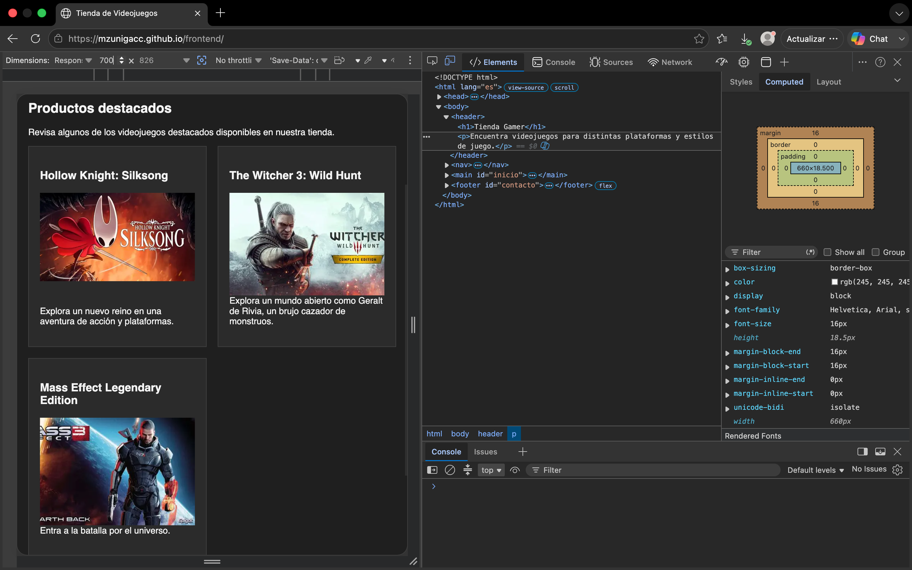
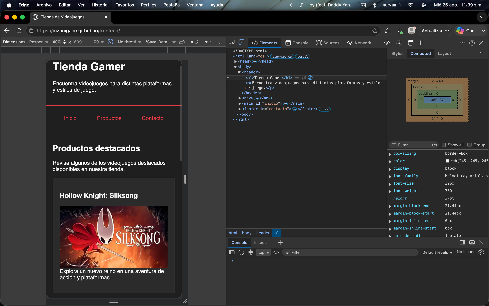
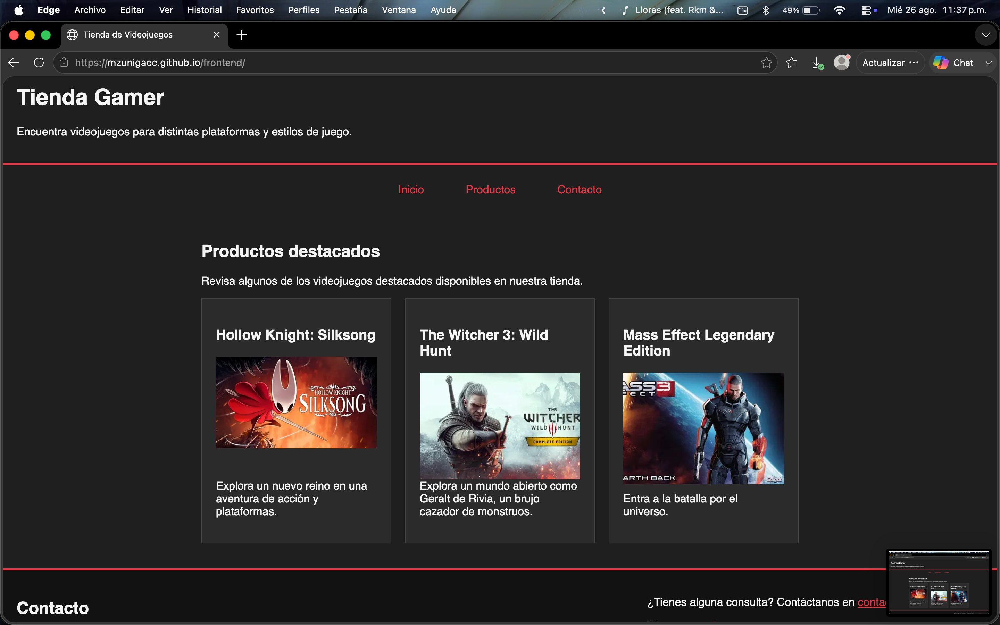

# Desarrollo Frontend I - Tienda Gamer

Proyecto desarrollado para la asignatura **Desarrollo Frontend I (PFY2201)**.

El sitio corresponde a una tienda de videojuegos y ha evolucionado durante las actividades de las primeras semanas del curso, incorporando progresivamente estructura HTML, estilos CSS y diseño responsivo.

## Semana 3 - Diseño responsivo

Durante la Semana 3 se incorporaron y reforzaron los siguientes conceptos:

- HTML semántico.
- Hoja de estilos CSS externa.
- Modelo de cajas y `box-sizing: border-box`.
- Variables CSS mediante `:root`.
- Tamaños tipográficos relativos con `rem`.
- Selectores de clase, ID, hijo directo y pseudo-clases.
- Flexbox para navegación, footer y estructura interna de productos.
- CSS Grid para la distribución del catálogo.
- Media queries para adaptar el diseño a escritorio, tablet y móvil.
- Imágenes responsivas.

### Comportamiento responsivo

- **Escritorio:** 3 productos por fila.
- **Tablet:** 2 productos por fila.
- **Móvil:** 1 producto por fila.
- El footer cambia su distribución mediante Flexbox según el ancho disponible.

## Validaciones

El sitio fue validado mediante:

- DevTools en distintas resoluciones.
- Pruebas en Chrome y Microsoft Edge.
- Visualización responsive en escritorio, tablet y móvil.
- Publicación mediante GitHub Pages.

## Evidencias

### Escritorio - 1000 px

### Tablet - 700 px

### Móvil - 400 px

### Footer responsivo

### Validación cross-browser en Edge

