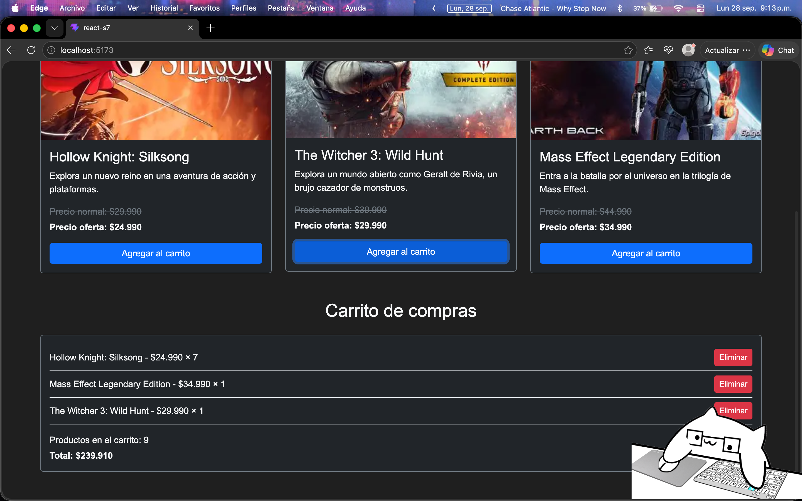
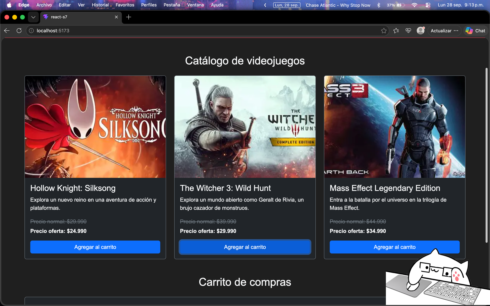

# Desarrollo Frontend I - PFY2201

## Semana 7 - Componentes funcionales en React

Actividad formativa correspondiente a la Semana 7 de la asignatura **Desarrollo Frontend I (PFY2201)**.

El proyecto continúa el desarrollo de **Tienda Gamer**, migrando las funcionalidades principales del eCommerce trabajado durante las semanas anteriores a una aplicación desarrollada con **React**.

## Funcionalidades implementadas

- Catálogo de videojuegos.
- Visualización de nombre, descripción, imagen, precio normal y precio de oferta.
- Carrito de compras mediante estado con `useState`.
- Agregar productos al carrito.
- Agrupación de productos repetidos mediante cantidad.
- Eliminación de productos del carrito.
- Cálculo automático de cantidad total de productos.
- Cálculo automático del precio total.
- Manejo de eventos mediante `onClick`.
- Renderizado condicional para mostrar el estado del carrito.
- Diseño responsivo utilizando Bootstrap 5.

## Componentes

La aplicación fue organizada mediante componentes funcionales reutilizables:

- `Header.jsx`: encabezado principal de la tienda.
- `ListaProductos.jsx`: genera el catálogo a partir de los datos disponibles.
- `Producto.jsx`: representa individualmente cada videojuego y permite agregarlo al carrito.
- `Carrito.jsx`: muestra los productos seleccionados, cantidades y precio total.
- `App.jsx`: administra el estado principal del carrito y las funciones para agregar y eliminar productos.

Los datos de los videojuegos se encuentran separados en `src/data/productos.js`.

## Tecnologías utilizadas

- React
- Vite
- JavaScript
- JSX
- Bootstrap 5
- CSS
- Git y GitHub

## Ejecución local

Desde la carpeta `react-s7`:

```bash
npm install
npm run dev
```

Luego acceder a la dirección local indicada por Vite.

## Evidencias

### E01 - Carrito de compras

Demuestra la incorporación de distintos productos, agrupación por cantidad, contador total y cálculo del precio total.



### E02 - Catálogo de videojuegos

Demuestra la presentación del catálogo con imagen, nombre, descripción, precio normal, precio de oferta y opción para agregar productos.

